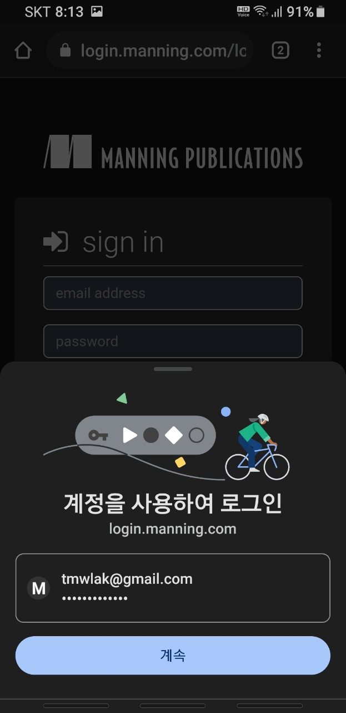

# UX 최적화

#### Q. 웹브라우저의 자동완성 기능을 제대로 활용하는 방법이 무엇인가 ?

A. 폼의 자동완성 기능을 제대로 활용하는 방법을 알아보자
로그인시에는 아 구글에서 제공하는 로그인 기능이 있다, 이 기능을 사용한다
카드를 등록할 때도 크롬에서 제공하는 맞춤형 완성 기능이 있다. 이 기능을 사용한다
이메일 입력칸과 전화번호 입력칸을 붙이는 이유는 자동완성 기능을 이용하기 위함이다

#### Q. 모 사이트에 들어가면 로그인할 때나 결제할 때 크롬 웹브라우저에 내부에 저장된 정보를 그대로 가져와 쓰는 경우가 있다. 예를 들어 아래 스샷과 같은 상황인데 이렇게 로그인 정보를 꺼내서 쓰는건 어떻게 할 수 있는가?

A. 크롬이 그냥 알아서 저장하는듯. 별도의 작업이 필요한 것 같지는 않아보임